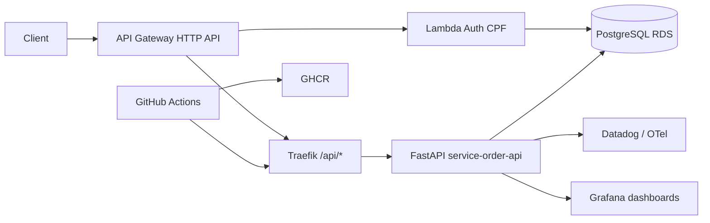

# Component Diagram

```mermaid
flowchart LR
  Client --> APIGW[API Gateway HTTP API]
  APIGW --> AuthLambda[Lambda Auth CPF]
  APIGW --> K3S[Traefik /api/*]
  K3S --> API[FastAPI service-order-api]
  AuthLambda --> RDS[(PostgreSQL RDS)]
  API --> RDS
  API --> DD[Datadog / OTel]
  API --> GF[Grafana dashboards]
  GHA[GitHub Actions] --> GHCR[GHCR]
  GHA --> K3S
```
