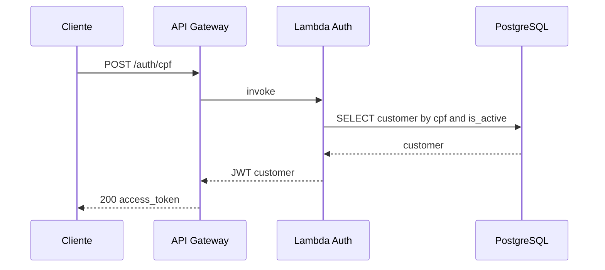
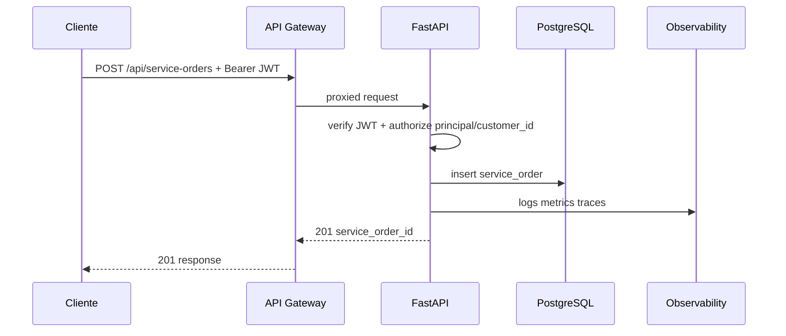

# Sequences

## Autenticação por CPF

```mermaid
sequenceDiagram
  participant C as Cliente
  participant G as API Gateway
  participant L as Lambda Auth
  participant D as PostgreSQL

  C->>G: POST /auth/cpf
  G->>L: invoke
  L->>D: SELECT customer by cpf and is_active
  D-->>L: customer
  L-->>G: JWT customer
  G-->>C: 200 access_token
```

## Abertura de ordem com JWT

```mermaid
sequenceDiagram
  participant C as Cliente
  participant G as API Gateway
  participant A as FastAPI
  participant D as PostgreSQL
  participant O as Observability

  C->>G: POST /api/service-orders + Bearer JWT
  G->>A: proxied request
  A->>A: verify JWT + authorize principal/customer_id
  A->>D: insert service_order
  A->>O: logs metrics traces
  A-->>G: 201 service_order_id
  G-->>C: 201 response
```
